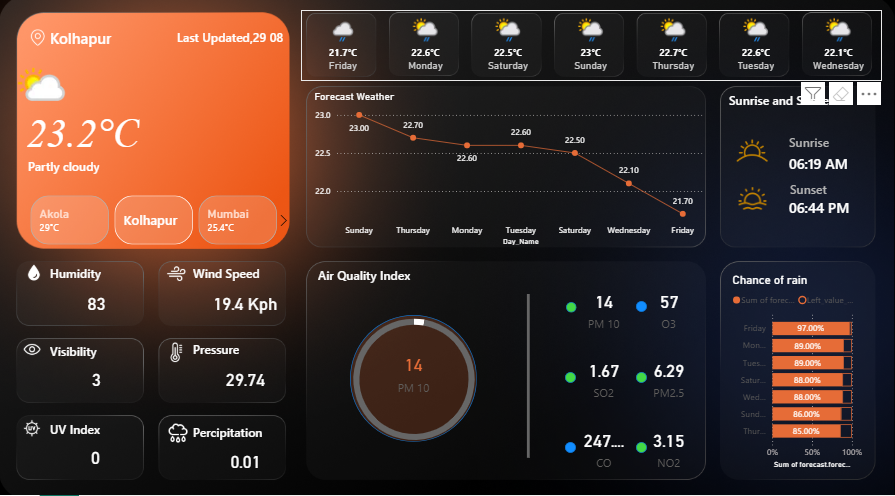

# Weather-API
Weather API
Here’s a professional **README.md** file you can use for your GitHub repository to showcase your Weather API and Power BI dashboard project:

---

# 🌦 Weather API Dashboard

This project demonstrates the integration of a **Weather API** with **Power BI** to build a real-time weather monitoring dashboard.
Using API key–based authentication, the system fetches live weather data and visualizes it in an interactive and user-friendly dashboard.

---

## 📌 Features

* 🌍 **City-wise weather tracking** – Example: Kolhapur, Akola, Mumbai
* 🌡 **Current weather details** – Temperature, humidity, pressure, wind speed, visibility
* ☁ **Forecast** – Upcoming days’ weather with temperature variations
* 🌞 **Sunrise & Sunset timings**
* 🌧 **Chance of rain prediction**
* 🌫 **Air Quality Index (AQI)** – PM10, PM2.5, SO2, NO2, O3, CO values
* 📊 **Dynamic Power BI dashboard** with interactive visuals

---

## 📷 Dashboard Preview

Here’s a snapshot of the Power BI dashboard created using the Weather API:

---

## 🛠 Tech Stack

* **Power BI** – For visualization and dashboard creation
* **Weather API** – For fetching live weather & AQI data
* **API Key Authentication** – Secure access to weather data

---

## 📊 Use Cases

* Real-time city weather monitoring
* Air quality & pollution analysis
* Travel & agriculture planning
* Learning project for **Power BI + API integration**

